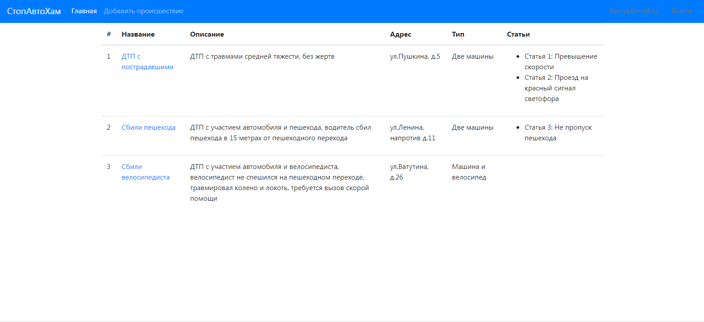
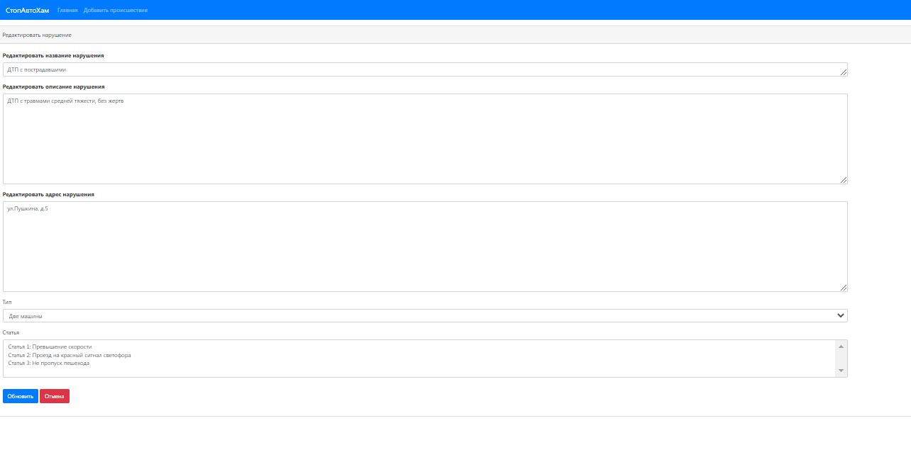
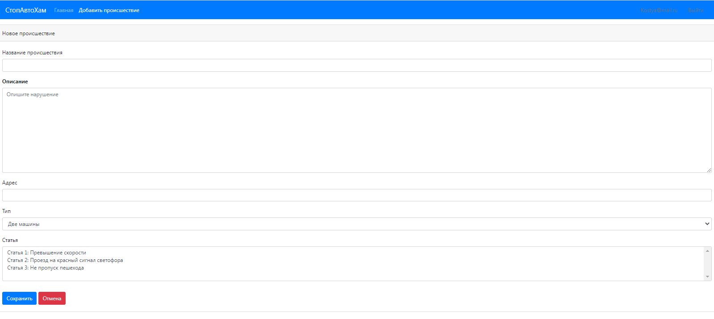
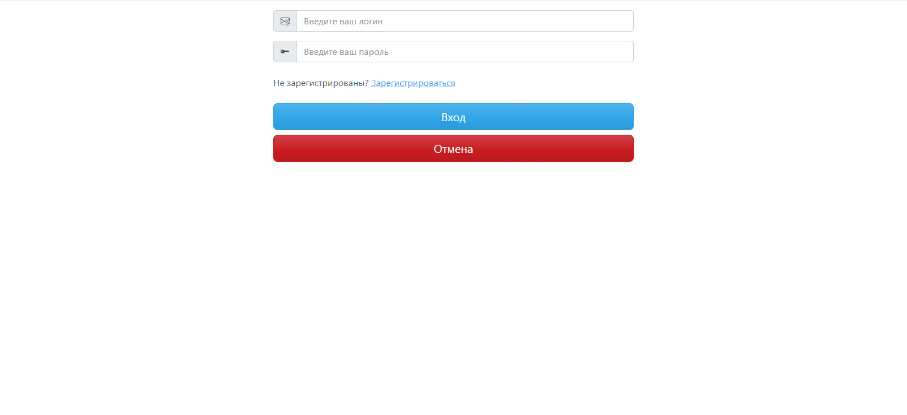
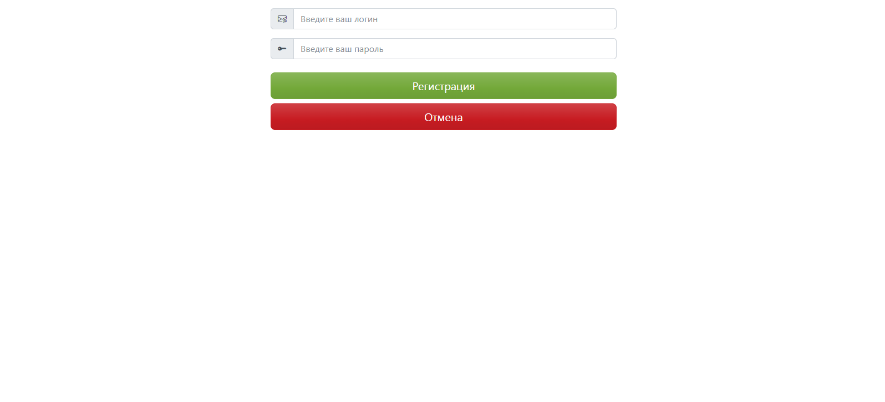

## Проект "Автонарушители".

### Описание проекта: В системе существуют две роли. Обычные пользователи и автоинспекторы.

#### Пользователь добавляет описание автонарушения.

#### В заявлении указывает: адрес, номер машины, описание нарушения и фотографию нарушения.

#### У заявки есть статус. Принята. Отклонена. Завершена.

## Стек технологий:
-Java 17
-Spring Boot version 2.7.6
-Thymeleaf
-Liquibase
-Maven 3.1.2.
-Sql2o version 1.6.0
-PostgreSQL 10
-H2
-jcip

## Требования к окружению:
- Java 17
- Maven версия не ниже 3.1.2
- PostgreSQL версия не ниже 10.

## Сборка и запуск:
- ___Запустить liquibase.update___

- ___Запустить проект через метод main() класса Main___

## Взаимодействие с приложением:

**Список всех происшествий.**

**Внутри конкретного происшествия.**

**Страница создания нового происшествия.**

**Страница входа.**

**Страница регистрации.**

### Контакты для связи:
#### telegram - @avdeev_konst